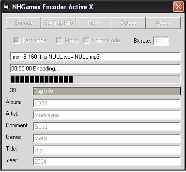



## Lame Active X

### Description

Converting Wave to MP3 using the Lame Active X Control.You need to download the activex control at http://jwstop.com/nhgames/vb/LameEncoderX.zip
 
### More Info
 
You need to download the activex control at

http://jwstop.com/nhgames/vb/LameEncoderX.zip

             |
---                |---
**Submitted On**   |2004-07-21 18:53:00
**By**             |[NHGames](https://github.com/Planet-Source-Code/PSCIndex/blob/master/ByAuthor/nhgames.md)
**Level**          |Intermediate
**User Rating**    |3.8 (15 globes from 4 users)
**Compatibility**  |VB 6\.0
**Category**       |[OLE/ COM/ DCOM/ Active\-X](https://github.com/Planet-Source-Code/PSCIndex/blob/master/ByCategory/ole-com-dcom-active-x__1-29.md)
**World**          |[Visual Basic](https://github.com/Planet-Source-Code/PSCIndex/blob/master/ByWorld/visual-basic.md)
**Archive File**   |[Lame\_Activ1772257212004\.zip](https://github.com/Planet-Source-Code/nhgames-lame-active-x__1-55073/archive/master.zip)

